# monetary-topology

Mechanism models for a topological framework of claims and resources.

A monetary claim and the resource it points at are two different objects. Most
of what follows from that is uncontroversial and widely conceded in principle.
This repository is about the part that is not: once claim circulation is
stratified, **a quantity of money does not establish access to resources. An
adjacency matrix does.**

The models here are small on purpose. Each isolates one mechanism, exposes fewer
than a dozen parameters, and reports a criterion that can fail. The point is not
to build a simulator large enough to reproduce an economy. It is to make a
handful of structural claims checkable by someone who did not write them.

**Status: stages A0, A0b, A2, A2c and B2 complete, 47/47 criteria pass.** The
simulation stages run across two independent parameterisations, one of them
calibrated to published Federal Reserve data, and across 12 graph seeds. The
empirical stage runs on **28,137,985 mortgage originations** reported to HMDA for
2018 through 2025, against a pre-registration written before retrieval began. See
[RESULTS.md](RESULTS.md) for the full record and [ROADMAP](#roadmap) for what is
not built yet.

The headline empirical number: hold census tract, year, lien position, loan
purpose, occupancy and dwelling type fixed, and **78 to 85 percent of the variance
in financing terms remains inside those cells.** A single price vector on
positions predicts zero. A pre-registered placebo, in which government programmes
replace the credit-graded price grid with a flat schedule, moves it in the
predicted direction by 130 times the scale of a gap known to be zero.

---

## The result

### Quantity does nothing; topology does everything

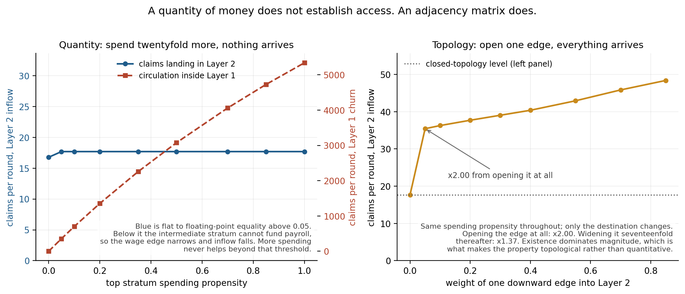

The standard objection to any account of stratified circulation is that the
money has to end up somewhere, so it must eventually reach the bottom. It does
end up somewhere. The somewhere has no edge to the bottom.

**Left panel.** The top stratum's spending propensity is swept from 0 to 1: from
hoarding everything to spending everything, every round. Claims landing in the
production layer are unchanged **to floating-point equality** across that entire
range. Over the same sweep, circulation inside the financial layer moves by a
factor of 15. Book velocity moves by an order of magnitude. Topological
displacement does not move at all.

**Right panel.** Now hold spending fixed and open a single edge from the top
stratum into the production layer. Inflow doubles the instant the edge exists at
weight 0.05, then rises only a further 37% as the edge is widened seventeenfold
to 0.85. **Existence dominates magnitude.** That asymmetry is what makes the
property topological rather than quantitative: the discontinuity is at zero, not
along the range.

One boundary case runs against the trickle-down reading and is reported rather
than smoothed over. At a propensity below roughly 0.05 the *intermediate*
stratum is never resupplied, its holdings fall below its share of payroll, and
the wage bill is capped by illiquidity. Inflow to the production layer then
falls. So the top's spending can matter, but only by keeping the intermediary
solvent enough to make payroll, never by arriving as demand. Above that
threshold, additional spending buys nothing.

### An instrument that cannot reach what it targets

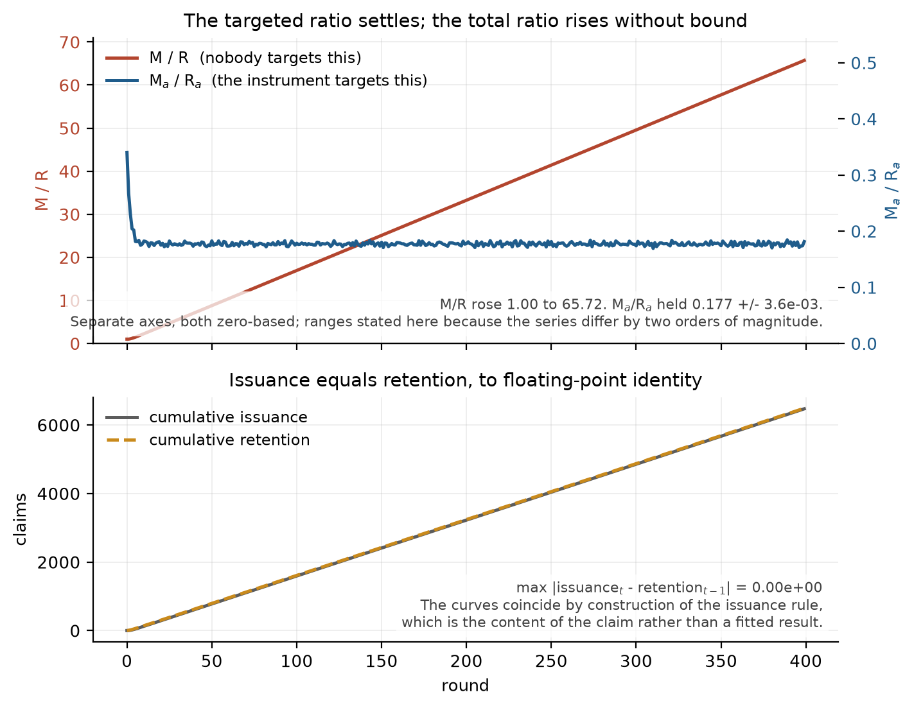

The monetary authority observes the ratio of *active* claims to *active*
resources and issues enough to restore it. Claims that have left cross-layer
circulation are outside the instrument's field of view by construction.

The targeted ratio holds at 0.177 ± 3.6e-03. The total ratio rises from 1.00 to
65.72 over 400 rounds, monotonically, without bound. Cumulative issuance equals
cumulative retention to floating-point identity — not as a fitted result but as
an algebraic consequence of the issuance rule, which is the content of the
claim.

By the end of the run the financial layer holds 99.8% of all claims, up from
72.9% at the start. Every unit was issued in order to restore circulation in the
production layer. The only downward edge is a fixed wage bill, so issuance
cannot reach the quantity it was issued to repair. This is stronger than saying
the instrument targets the wrong variable: it targets a variable it has no
transmission path to.

### The production layer settles at the payroll edge

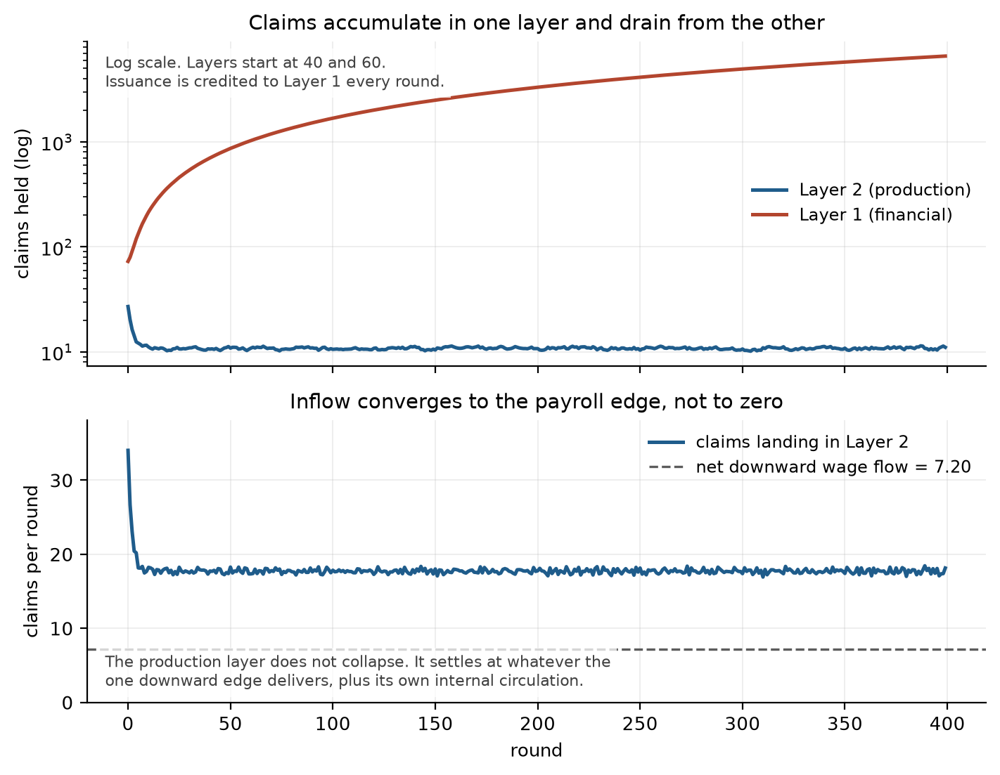

The production layer does not collapse to zero. It converges to whatever the one
downward edge delivers plus its own internal circulation, and sits there
indefinitely while the financial layer grows without bound beside it. Nothing in
any aggregate would show a crisis. The two layers are simply no longer part of
the same circuit.

That floor turns out to be an artefact of holding the wage bill fixed, which
leads to the next result.

### Only the autonomous part of the downward flow survives

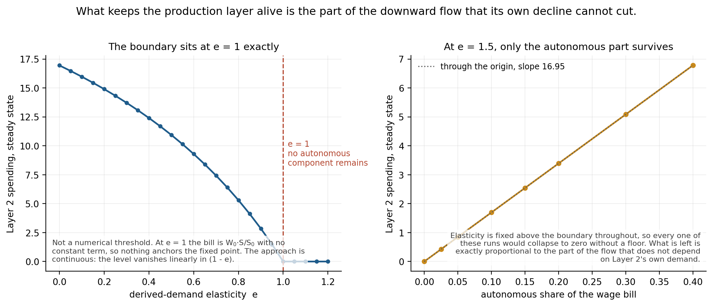

Employment is not exogenous. The framework's own claim is that hiring derives
from final demand, so when the production layer's spending falls, payroll falls
with it, cutting the production layer's income further. Adding one parameter, the
derived-demand elasticity `e`, gives

```
W_t = W_0 · [ (1 − e) + e · S_(t−1)/S_0 ]
```

with `S` the production layer's spending. `e = 0` recovers the fixed bill
bitwise, so this is a strict generalisation and the earlier figures are unchanged.

**The boundary sits at `e = 1` exactly, and it is structural rather than
numerical.** Below one, the bill keeps a constant term `W_0(1−e)` that anchors a
positive fixed point, and the steady-state level vanishes linearly in `(1−e)`. At
one that term is gone and the only fixed point is zero. Nothing is tuned to
produce this; the boundary is where the autonomous component of the bill
disappears.

The right panel fixes `e = 1.5`, safely past the boundary so that collapse is
certain, then varies how much of payroll is contractually rigid within a period.
The surviving level is **exactly proportional to that autonomous share**, a line
through the origin to a residual of 8.9e-16. At an autonomous share of 1 it
recovers the fixed-bill level precisely.

So the mechanism has a sharp statement: **whatever is derived from the production
layer's own demand cancels itself in a decline. What keeps the layer alive is
only the part of the downward flow that the layer's own fall cannot cut.**

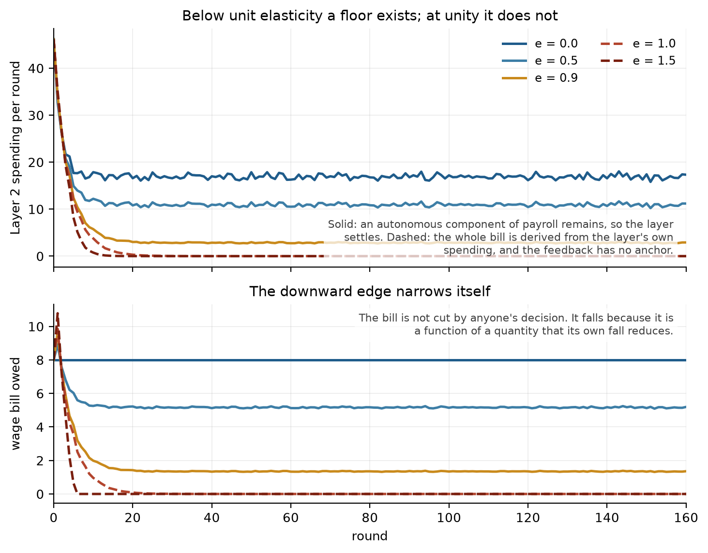

Note what the lower panel is not showing. The bill is not cut by any decision.
It falls because it is a function of a quantity that its own fall reduces.

### The findings do not depend on the invented numbers

The source framework's worked example uses round figures: three strata holding
30% each. Those could be doing the work. So every one of them is replaced with a
published estimate and everything is re-run.

**Wealth shares** come from the Fed Distributional Financial Accounts, Q1 2026,
share of total net worth, retrieved 2026-08-08. The DFA's own percentile grouping
is 1 / 9 / 40 / 50, which maps onto the model's four strata with no
interpolation:

| stratum | share | FRED series |
|---|---|---|
| top 1% | 31.6% | `WFRBST01134` |
| next 9% (90-99) | 36.3% | `WFRBSN09161` |
| next 40% (50-90) | 29.6% | `WFRBSN40188` |
| bottom 50% | 2.5% | `WFRBSB50215` |

**Propensities** come from Fagereng, Holm & Natvik, *MPC Heterogeneity and
Household Balance Sheets*, AEJ: Macroeconomics 2021: low-liquidity winners of
small lottery prizes spend essentially all of the win within the year,
high-liquidity winners of large prizes slightly below one half. Their estimand is
the MPC out of a transitory shock rather than a spending rate out of holdings, so
what this licenses is the range and the ordering, not the exact values. Stated in
`calibration.py` rather than left for a reader to discover.

Every finding survives, and barely moves:

| | source-faithful | DFA Q1 2026 |
|---|---|---|
| spending-sweep spread | 0.0 | 0.0 |
| Layer 1 churn factor over the sweep | 15.0 | 15.3 |
| jump from opening one edge | x2.00 | x2.02 |
| Layer 1 share of claims, steady state | 0.9982 | 0.9983 |
| derived-demand boundary | e = 1.00 | e = 1.00 |

The DFA distribution is more unequal than the toy one and produces a *stricter*
version of the retention ordering the framework assumes: 0.025 / 0.10 / 0.45 /
0.52 against the worked example's 0.06 / 0.065 / 0.50 / 0.50, where the top two
were tied.

Both presets are run by every experiment and both are recorded in RESULTS.md. A
finding that held under only one of them would be a finding about that preset.

---

## Stage A2: the same dynamics on a graph

A0 runs on four strata, which is the block aggregation of a network. A2 runs the
same rules on the network itself, which makes a question available that the block
model cannot pose: not how much is circulating, but **how many nodes the
circulation still reaches**.

The graph reduces correctly. Layer 1 ends holding 0.997 to 0.998 of all claims
across seeds, against the block model's 0.9982, so the two stages are describing
the same economy at different resolutions.

### The measure has no threshold, on purpose

Proportional claim dynamics on a fixed graph have a positive stationary
distribution: nothing ever reaches exactly zero. So any measure of the form
"count nodes above a cutoff" reports the cutoff as much as the economy. Adding a
minimum operating scale would fix that, but it would import the mechanism stage
A1 exists to study and would invite the fair objection that a threshold was
inserted in order to make nodes disappear.

The headline measure is therefore the **effective support**, the reciprocal
Herfindahl index of the inflow distribution: the effective number of firms from
industrial organisation, applied to circulation rather than market share. It
equals the node count under an even spread, falls as flow concentrates, needs no
cutoff. A cutoff-based reachability series is kept as a secondary check with the
cutoff swept.

### The injection is what breaks the sign relation

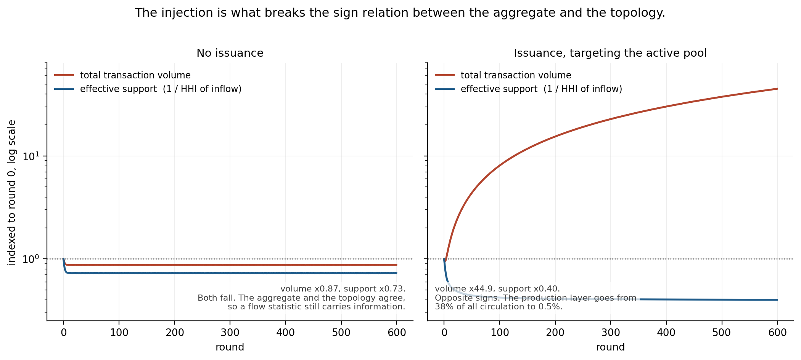

|  | total volume | effective support | production layer's share of all circulation |
|---|---|---|---|
| no issuance | **x0.87** | x0.73 | 38% → 26% |
| issuance | **x44.9** | x0.40 | 38% → **0.5%** |

Without issuance the two move together and an aggregate flow statistic still
carries information: volume falls, the reachable economy contracts, and the
number tracks the problem.

Turn issuance on and the signs come apart. New claims enter at the top and
recirculate inside a dense core, so volume rises by a factor of forty-five, while
the effective number of nodes reached keeps falling. **The aggregate is not
merely a poor measure at this point, it is anti-correlated with what it is being
used to monitor.** 12 of 12 graph seeds flip under issuance; 12 of 12 agree
without it.

The uncomfortable part is the timing. The instrument is used precisely when there
is a problem, so the aggregate reads best exactly when the underlying position is
worst.

### Reachability decides, not propensity

The standard account of a demand shortfall runs through the marginal propensity
to consume, a property of the agent. The framework's claim is about edges.

Give one household node the **maximum possible propensity** and sever its
in-edges. Final holdings: exactly zero, on every seed. An agent that would spend
everything, spends nothing, because nothing arrives.

### The intermediate layer

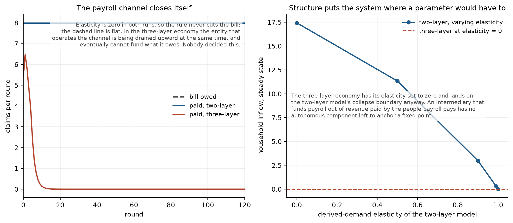

A third block sits between the two. It collects household spending as revenue,
pays rent and financing costs upward, and **operates the payroll channel
downward**. That is a position no node can occupy in a two-layer graph, where the
payer is rich and the recipient is the victim and nobody is both.

Two hypotheses were written into the module docstring before the code was run,
along with the null, so that any outcome could be reported.

**H1 holds.** The payroll channel closes on its own. The elasticity is zero and
the bill *owed* never moves off 8.00, so nothing in the rule cuts hiring and no
agent decides anything. What falls is the amount *paid*, because the entity
operating the channel is being drained upward at the same time and eventually
cannot fund what it owes. Funding ratio 0.68 → 0.000 across 6 seeds and three
block sizes. The two-layer control sits at exactly 1.0000 forever.

**H2 holds, in its strong form.** A three-layer economy with its elasticity
parameter set to **zero** lands where the two-layer economy only reaches at
elasticity **one**: the A0b collapse boundary. An intermediary funding payroll out
of revenue paid by the people payroll pays has no autonomous component left to
anchor a fixed point. The structure puts the system on the boundary; no parameter
was set to put it there.

### One customer in the layer above

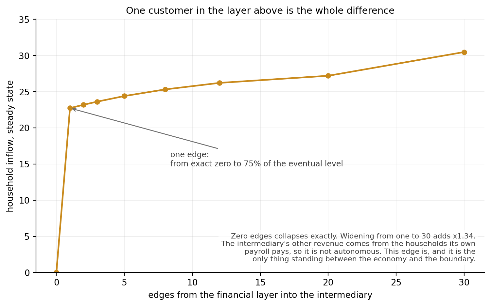

Real intermediaries have another revenue source: they sell to the layer above.
Give the intermediary a single edge from the financial layer and the whole economy
is rescued.

| edges from the financial layer | household inflow | payroll funding ratio |
|---|---|---|
| 0 | **0.000** | 0.000 |
| 1 | 22.73 | 0.61 |
| 30 | 30.48 | 0.98 |

Zero collapses in all 36 tested configurations. One edge reaches 75% of the
eventual level. Thirty edges add a further 34%.

The economic reading is a firm-level K shape: an intermediary with one customer
in the financial layer survives, one with none dies, and it does not depend on how
much it sells but on whether it is connected at all.

**A caveat that belongs with this result rather than after it.** "Existence
dominates magnitude" has now appeared three times in this repository, with
strikingly similar saturation factors (x1.37 and x1.38). That is not three
independent pieces of evidence. A discontinuity at zero is unsurprising on its
own, because reachability is binary and an unreachable set is simply unreachable;
the construction guarantees the jump. What the runs supply is the size of the
step and the rate of saturation past it, and only those are results.

### Two things that turned out not to matter

Reported because they were expected to matter and did not.

- **Degree heterogeneity.** The heavy-tailed upward-leakage ratio, motivated by
  fixed costs falling hardest on the smallest firms, was expected to drive the
  contraction. The homogeneous control gives the same divergence to within 15%.
  What drives it is the layer structure together with the injection point.
- **The initial holdings distribution.** Spreading initial claims by in-degree
  and spreading them evenly give identical results.

---

## Stage A2c: cycle structure

Volume II of the source framework argues that a price field on an economy is
non-integrable, so local signals cannot be aggregated into a global view. That is
a structural, universal claim and **no simulation can establish it**. This stage
does not try. It measures, on runs stage A2 already produces, the object the
argument is about: cycle structure.

Two things are computable from a graph and a flow, neither requiring a price. The
first Betti number `E − V + C`, the number of independent cycles. And the discrete
Hodge decomposition of net flow into gradient, curl and harmonic parts.

**What is deliberately not done.** Decomposing net *claim flow* is not decomposing
a *price field*. The gradient part of a flow means the flow is explained by a
scalar node potential, a pressure. The gradient part of a price field means an
integrable price level. These are different objects sharing a name, and calling
one the other would be the substitution this project refused at stage A0. This
stage is an analogue, not an instance. Holes are also never punched by hand:
deleting edges and watching the rank fall verifies `E − V + C`, so that version
lives in the test suite labelled as a code check.

**The one modelling choice, stated rather than buried.** On a bare graph the Hodge
decomposition has only two parts. Splitting the cycle space into curl and harmonic
requires deciding which loops are filled in. The default fills every triangle,
which asserts that a three-way trading loop is not a structural hole. That is a
modelling decision, not a mathematical fact; `fill_triangles=False` reports the
two-way split and both are tested.

### Circulation grows, net displacement does not

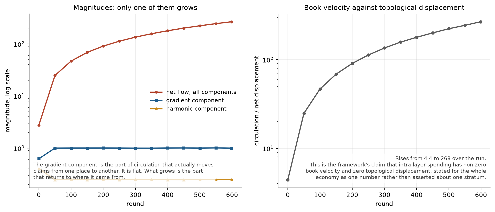

The gradient component of net flow is the part that actually moves claims from
somewhere to somewhere. Everything else returns to where it came from.

Over 600 rounds the total net flow grows by a factor of 97 while the gradient
component stays within a factor of 1.62. The ratio of circulation to net
displacement rises from 4.4 to 268.

That is the framework's claim about book velocity and topological displacement,
stated for the whole economy as one number instead of asserted about one stratum.

**A trap worth recording.** The gradient *share* falls from 5.1e-02 to 1.4e-05,
which reads like the displacing component vanishing. It is not: the magnitude is
flat and the denominator grew a hundredfold. The same applies to the harmonic
component, whose magnitude stays within a factor of 1.65 while its share falls by
four orders of magnitude. Every quantity here is reported as a magnitude
alongside its share, because reporting shares alone would have described a
dilution as a disappearance.

### Loops disappear with nothing deleted

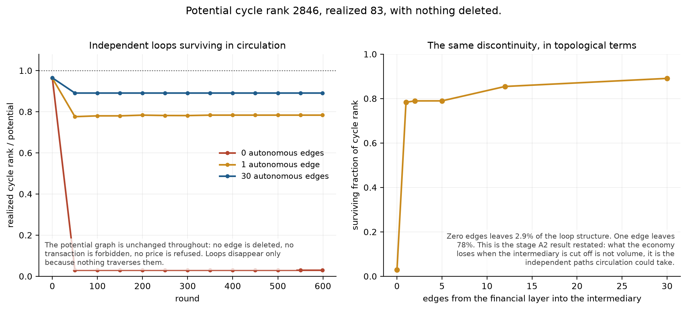

In the three-layer economy with the intermediary cut off from the layer above:

| | potential cycle rank | realized | surviving |
|---|---|---|---|
| 0 autonomous edges | 2846 | **83** | 2.9% |
| 1 autonomous edge | 2847 | 2230 | 78% |
| 30 autonomous edges | 2871 | 2557 | 89% |

The potential graph is identical throughout. No edge is deleted, no transaction is
forbidden, no price is refused. **97% of the independent loops stop existing
because nothing traverses them.** What the economy loses is not volume but the
number of distinct paths circulation could take, and 6 of 6 graph seeds agree.

### A limitation, kept as a criterion

Cycle rank is a binary count over edges. Proportional dynamics leave every edge
carrying something, so in the **two-layer** model the realized rank is flat at
1074 against a potential 1190 for the whole run: inert. It moves only where flow
genuinely stops, which is why the three-layer economy is where it says anything.

This is criterion A2c-7 rather than a footnote, so that a future refactor cannot
quietly drop it and leave the method looking more general than it is.

---

## Stage B2: the same claim, on twenty million real loans

Everything above is simulation. This is not.

The framework's structural claim is that the effective cost of holding a position
is a **two-index** field `P(a, g)`: the terms on which agent class `a` can hold
position `g`. A single price vector is the special case `P(a, g) = p(g)`, which
asserts that terms do not depend on who is transacting. If that special case held,
the field would be the gradient of a scalar on positions and every loop sum in it
would be zero.

That is testable without any topology at all. Fix the position and the date: same
census tract, same year, same lien position, same loan purpose, same occupancy
type, same dwelling category, same product. A gradient field predicts that every
applicant in such a cell faces **identical** terms, so the within-cell variance is
exactly zero. What is left over is the part no scalar on positions can reproduce.

```
Var(rate spread) = between-cell + within-cell
                   ^^^^^^^^^^^^   ^^^^^^^^^^^
                   what a         what no
                   position       position
                   index          index
                   explains       can explain
```

The sample is every conventional first-lien single-family home purchase
origination reported to HMDA for 2018 through 2025, all fifty states plus DC:
**20,071,900 loans in 1,103,962 cells.** The measured quantity is rate spread, the
loan's APR minus the average prime offer rate for a comparable transaction at the
date the rate was set, which is already stated against a common benchmark so that
a difference within a cell is a pairwise loop sum needing no further
normalisation. Every filter was fixed in
[`docs/b2_measurement.md`](docs/b2_measurement.md) before retrieval began, and
`data/raw/*_manifest.json` records the URL and timestamp of all 408 queries.

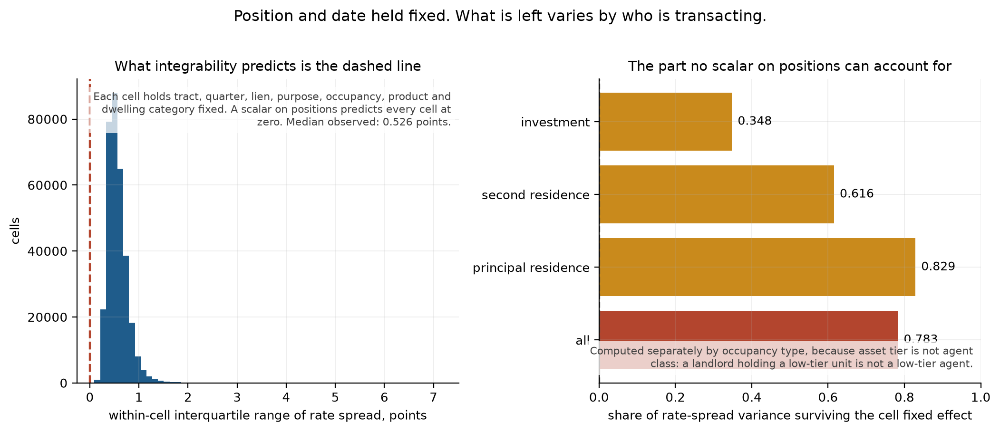

**The within share is 0.7831 over all cells and 0.8480 over cells holding at least
twenty loans.** Integrability predicts 0.0000. The median cell's interquartile
range is 0.5257 points and its p90 minus p10 is 1.0774 points, against a
whole-sample standard deviation of 0.6625: **the spread inside a typical cell is
about as wide as the spread across the entire country.**

### The number was wrong first, and how it was wrong is the point

The first run reported 0.9750000458 overall, 0.9750000484 on principal residences
and 0.9749976781 on principal residences unrestricted. Three subsamples differing
by hundreds of thousands of cells, agreeing to six decimal places, at a round
number.

`0.975` is `39/40`, and it was literally that fraction. One filer had reported a
rate spread of `-9999997`, and that row happened to sit in a cell holding forty
loans. An isolated value `M` in a cell of size `k` contributes `M²(k−1)/(nk)` to
the within term and `M²/(nk)` to the between term, so the share it forces is
`(k−1)/k` — with `M` cancelling out entirely. The magnitude of the bad value never
appears in the answer; only the size of the cell it landed in does.

The arithmetic closes to six significant figures. `M²/n` predicts a total variance
of 6,181,523.5 against 6,181,526.7 observed. On the unrestricted sample, observed
total divided by `M²/n` is 4.000020, counting the offending rows exactly.

160 rows out of 20,071,900 are filer placeholders rather than interest-rate
differences: one filer writes `1111` into rate spread, interest rate and loan term
together; others use `99.99`, `100.0` or `123.0` as a ceiling sentinel. Excluding
them takes the total variance from 19,928,446 to **0.439**.

Two things make the exclusion non-load-bearing, and both are criteria rather than
prose. **B2A-6** recomputes the decomposition at exclusion bands of 10, 15, 20, 25,
30 and 50 points; the resulting shares span 9.6 × 10⁻⁴. **B2A-7** computes the same
decomposition on tie-averaged **ranks of the raw sample, excluding nothing at
all**, and gets 0.7654 and 0.8181. A rank is bounded by the sample size however
large the value is, and ties preserve the null exactly: under integrability every
loan in a cell reports the same spread, tied values receive identical ranks, and
the within-cell rank variance is exactly zero.

The corrected figures are **lower** than the artifact and are the ones that mean
something. The full arithmetic is in section 10 of the measurement document,
flagged as a post-result change, with the residual left unrounded.

The general lesson is recorded because it will recur: variance is not robust under
heavy-tailed contamination and a decomposition of variance inherits that. Every
future carrier gets the band sweep and the ranked analogue as standard, not as a
repair.

### A graded placebo, where one arm can fail and the other cannot

Dispersion at fixed position and date does not by itself show that the dispersion
is carried by the agent index. It could be something the cell keys failed to hold
fixed. The test needs a case where the agent index is suppressed **by rule** while
every position key stays identical.

Government-insured lending is that case. Conventional pricing runs an explicit
credit-graded surcharge grid. FHA replaces it with a flat insurance premium
schedule and VA with a funding fee that moves with down payment and prior use but
not with credit score.

The obvious prediction — FHA below conventional — has a duller rival that predicts
the same sign: FHA borrowers are a **narrower pool**, so `a` spans a shorter
interval and `P(a, g)` varies less over the realised sample even if the field is
exactly as non-integrable. Same sign, so FHA alone discriminates nothing.

**VA separates them.** Eligibility is service-based rather than credit-based, so
the pool is wide, while the price grid is flat. The two accounts disagree:

| | pool width | credit-graded grid | pool-width account predicts | agent-index account predicts |
|---|---|---|---|---|
| conventional | wide | yes | high | high |
| FHA | narrow | no | low | low |
| **VA** | **wide** | **no** | **high, near conventional** | **low, near FHA** |

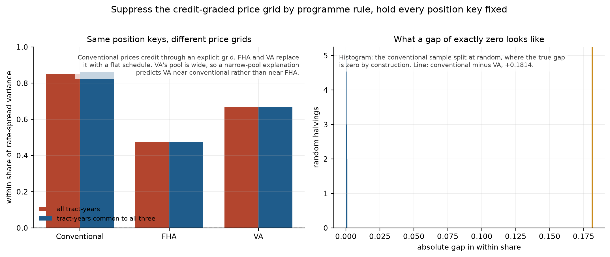

**Conventional 0.8480, VA 0.6666, FHA 0.4757.** VA lands nearer FHA. The
pool-width account is rejected.

The gap needs a scale. The conventional sample was split at random twenty times
and the same difference computed between halves, where the true value is zero by
construction: **the largest such gap is 0.0014.** The conventional-VA gap of 0.1814
is 130 times that, and 0.0855 in the ranked version is still 61 times it.
Restricting all three to the 409,181 tract-years common to every programme widens
the gap to 0.1944, so geography was masking it slightly rather than producing it.

All four pre-registered predictions passed, and the directions, the margin and the
null were fixed in section 8.1 before an FHA or VA row was retrieved.

### Two things found afterwards, kept separate because they were not predicted

The strongest surviving objection was that a VA cell needs twenty purchase loans in
one tract-year to qualify, which in practice means a tract near an installation,
where borrowers may be alike in pay grade and tenure. That would reintroduce the
narrow-pool story one level down. Lowering the cutoff from 20 to 5 takes VA from
24,880 cells to 157,807 — far past any installation effect — and moves its share
from 0.6666 to 0.6748. Raising it to 100 leaves 1,652 cells and gives 0.6322. The
objection predicted a large move and the observed move is 0.043 against a gap of
0.18. It fails. FHA, by contrast, moves three times as far over the same sweep,
which is what a genuinely narrow pool looks like.

Section 8.1 registered no direction for FHA against VA and said the outcome would
be reported and not interpreted. It came out at −0.1909, and the three programmes
then read as a design with one cell missing:

| | wide pool | narrow pool |
|---|---|---|
| **graded grid** | conventional 0.8480 | *(no programme)* |
| **flat schedule** | VA 0.6666 | FHA 0.4757 |

The pricing channel is 0.1814 and the pool-width channel is 0.1909; they are
close in magnitude and together span the whole distance. **This reading is
post-hoc**, additivity is assumed rather than shown, and it cannot be shown without
the fourth cell — which no programme occupies, because programme rules bundle who
may enter with how they are priced. It is stored under `post_hoc_not_pre_registered`
in the result record for that reason.

One more gradient appeared once the artifact was cleared. Within-share by occupancy
runs **principal residence 0.8289, second residence 0.6155, investment 0.3482.**
Investment property is underwritten on the asset — debt service coverage, loan to
value, rental income — so the lender is pricing the dwelling and `P(a, g)`
approaches `p(g)`. Owner-occupied lending is underwritten on the borrower. The
strength of non-integrability rises monotonically as the object being underwritten
moves from the asset to the person, which is a prediction the framework was not
built to produce.

### What stage B2 does not establish

It does not attribute the dispersion. HMDA's public file **redacts credit score**,
so this shows that terms disperse at fixed position and date without saying which
borrower attribute carries it. Non-integrability requires a non-zero loop sum; it
does not require the loop sum to be explained.

It does not exercise the topology. The decomposition is over a **partition**, not a
graph: no cycle space, no Hodge decomposition, no Betti number. The pairwise
difference between two borrowers in one cell is a loop of length two in a trivially
connected structure. Whether the partition result is a special case of the
cohomological claim or a weaker relative is the open question, and it is what the
B1 theorem has to settle before a second carrier is chosen.

It is a lower bound. HMDA records financed purchases only, so all-cash buyers — who
face no financing term at all — are absent, and they are most absent in exactly the
markets where the pattern is strongest. The censoring runs against the claim.

---

## What the model assumes

Stated plainly, because the results follow from these and a reader should be
able to attack them directly rather than reverse-engineer them from code.

**Load-bearing.** The financial layer has no discretionary edge into the
production layer. Its spending can land only inside itself. The single downward
connection is a wage bill, modelled separately because it is set by hiring
decisions rather than by how much anyone chooses to consume. Collapsing the two
would put the conclusion of the left panel into its premise.

If you think this zero is too strong, do not argue about it. `Adjacency.
with_downward_edge(w)` opens it, and the right panel reports exactly what
happens across the full range. That comparison is the deliverable of this stage.

**Also assumed.**

- Four strata. Under the source-faithful preset: 49 agents holding 10%, 40
  holding 30%, 10 holding 30%, 1 holding 30%. The last three come from the
  framework; the bottom 49 is our explicit completion of a residual it leaves
  implicit, and dropping it would have flattered the result. Under the DFA preset
  the strata are the published percentile groups.
- Spending is a propensity on holdings, not a fixed amount. Retention rate is
  then `1 - propensity`, which is what the source means by a rate of exit from
  cross-layer circulation rather than a hoarding rate.
- The production layer's outflow exceeds its downward inflow, by 2.214x under the
  source preset and 2.368x under the DFA one. **This is a parameter, not a
  result.** The stage traces what follows from a drained layer and does not claim
  to derive the shortfall. The wage bill that sets it is not calibrated under
  either preset; it is swept instead.
- The derived-demand elasticity is a free parameter swept from 0 to 1.2, and the
  sweep extends past unity deliberately. Employment adjusts in lumps, and both
  the framework's account and the standard derived-demand argument imply a fall
  in final demand is amplified rather than damped on the way into payroll. Where
  the boundary falls is the result, not the assumption.
- Claims and resources start one-to-one; resources are fixed with no real
  growth.

**Deliberately absent.** Credit creation, default, prices beyond a single index,
any network finer than stratum-level adjacency, and cross-layer bidding for a
shared resource pool. That last one matters: asset inflation squeezing the
production layer is a real mechanism and it is in the source framework, but
modelling it needs a price system with cross-layer asset markets. Inventing a
deflator here to get the result earlier would be using formalisation to endorse
a conclusion instead of checking it.

**A0 therefore reports claims, not real resource allocation.** That is a
limitation, and it is the reason stage A3 exists.

---

## What this is not

- Not a forecast. Nothing here predicts the timing of anything.
- Not *fitted* to data. Published levels are substituted directly into the model
  and nothing is estimated from a target. Stage A1 is the first stage where the
  model is asked to match a series.
- Not a claim that the standard stylised facts of the agent-based macro
  literature are reproduced. Most of them are reproduced by models with no
  layered structure at all, so reproducing them would carry no differential
  information. They are an entry ticket, reported in an appendix at stage A3,
  and they are not used as criteria here.
- Not a claim that the adjacency matrix or the wage bill are measured. They are
  the two places where the model is still assumption, which is why both are swept
  rather than defended, and why obtaining real adjacency data is the top item in
  `data/SOURCES.md`.

---

## Running it

```bash
git clone https://github.com/<user>/monetary-topology
cd monetary-topology
pip install -e ".[dev]"

pytest                                       # 147 tests
python experiments/a0_retention.py           # figures 1-3, 9 criteria
python experiments/a0_derived_wages.py       # figures 4-5, 6 criteria x 2 presets
python experiments/a2_support_contraction.py # figures 6-8, 8 criteria
python experiments/a2c_cycle_structure.py    # figures 9-10, 7 criteria
python scripts/render_results.py             # regenerates RESULTS.md
```

Every experiment script exits non-zero if a criterion fails, so every published
claim is re-checked on each commit rather than trusted. `.github/workflows/ci.yml`
runs lint, the test suite, all three experiments, and a check that `RESULTS.md`
matches what the code currently produces.

Optional arguments: `--rounds N`, `--seed N`. Results are reproducible for a
given seed, and every qualitative finding above was verified to hold across
seeds 0-19: the spending-sweep spread is exactly 0.0 in all twenty, the churn
factor is 15.0 in all twenty, and the edge-opening jump ranges from x1.89 to
x2.01.

---

## Repository layout

```
src/monetary_topology/
  config.py        all parameters, with sources and justifications
  economy.py       the block model (A0)
  network.py       the graph model and the intermediate layer (A2)
  topology.py      incidence operators, Betti number, Hodge split (A2c)
  calibration.py   the two presets, with series IDs and citations
  variants.py      config copying, so a sweep cannot re-default a field
  plotting.py      figure style
experiments/
  a0_retention.py           figures 1-3, criteria A0-1..9
  a0_derived_wages.py       figures 4-5, criteria A0b-1..6 under both presets
  a2_support_contraction.py figures 6-8, criteria A2-1..8
  a2c_cycle_structure.py    figures 9-10, criteria A2c-1..7
scripts/
  render_results.py    regenerates RESULTS.md from results/*.json
tests/
  test_a0_economy.py        25 tests
  test_a0b_derived_wages.py 26 tests
  test_a2_network.py        68 tests
  test_a2c_topology.py      28 tests
figures/         committed; they are the artefact
results/         committed; machine-readable run records
data/            not committed. SOURCES.md records provenance
```

No notebooks. Every result is produced by a script that runs start to finish
with no hidden state, and every parameter that affects a published figure is
declared in `config.py` where it can be read without reading the simulation
loop.

### Two invariants enforced in code

```python
# economy.py, every round. Raises on violation.
assert abs(claims_after - claims_before) <= 1e-9

# tests/. The identity behind "the rise in M/R equals cumulative retention".
np.testing.assert_allclose(h.issuance[1:], h.retention[:-1], atol=1e-9)
```

Stock-flow consistency is an assertion in the main loop rather than a check
performed afterwards. If it fails, the run stops and no figure is produced.

---

## Roadmap

Two tracks, run in parallel. They share no code because they answer different
kinds of question.

**Track A — distribution dynamics.** Computational claims: whether a support set
contracts depends on parameter magnitudes and cannot be settled structurally.

| stage | subject | status |
|---|---|---|
| A0 | retention and allocation | **complete, 9/9** |
| A0b | derived demand on the downward edge | **complete, 6/6 under both presets** |
| A2 | support-set contraction, and the intermediate layer | **complete, 8/8 over 12 graph seeds** |
| A2c | cycle structure of the realized graph | **complete, 7/7** |
| A1 | default waterfall, calibrated to delinquency cross-sections | not started |
| A3 | **the asset price channel** | redefined, see below |

**A3 has been redefined and it is no longer a merge.** The original plan made it
an integrated simulator that combined the earlier stages. That is now the wrong
target. Stages A0 through A2c measure claim circulation and report levels: a layer
drains, a support set contracts, loops stop being traversed. None of them can
produce a *widening gap* between agents who began level, because none of them has
an asset whose value responds to where claims accumulate.

That channel is where compounding comes from. Claims pile up in the financial
layer, the financial layer bids on assets, holders gain and non-holders are priced
out of entry, and the agents who could not enter at the start cannot enter later
either. The source framework describes this directly, and
[`docs/b1_setup.md`](docs/b1_setup.md) shows why it is load-bearing rather than
decorative: with an asset, a per-period loop sum `δ` opens a gap of `exp(Tδ)`, and
the framework's settlement ratchet turns out to be its non-integrability read at a
different horizon.

So A3 is one mechanism, not four glued together, and the same discipline applies as
before: with the asset channel switched off it must reproduce A0 through A2c
exactly, and those stages remain the control that the channel is measured against.

A0b changes what A1 needs. With a fixed wage bill the production layer settles,
and a default model bolted onto a settled layer can match a level but not a
dynamic. With derived demand the layer has a genuine downward trajectory whose
speed is governed by one parameter, which is the driver a default cascade
requires. Two DFA figures are already recorded in `calibration.py` as A1's
targets: the bottom half of the distribution holds 51.8% of all consumer credit
(`WFRBSB50211`) against 2.5% of net worth.

A3 is gated deliberately. A model with four layers, exhaust valves, quasi-money
creation and a default cascade has enough freedom to produce nearly any output.
Stages A0 through A2 exist so each mechanism carries two or three parameters and
a reader can verify by hand that a result is not an artefact of tuning.

**Track B — non-integrability.** Structural claims: the assertion is that a
global object does not exist, which is universal and cannot be established by
simulating instances.

| stage | subject | status |
|---|---|---|
| B1 setup | fixing the field so the claim is not vacuous | **complete**, [`docs/b1_setup.md`](docs/b1_setup.md) |
| B2 design | pre-registration, filters, falsifications | **complete**, [`docs/b2_measurement.md`](docs/b2_measurement.md) |
| B2 loop A | dispersion at fixed position and date | **complete, 7/7** on 20,071,900 loans |
| B2 placebo | conventional against FHA and VA | **complete, 4/4** on a further 8,066,085 |
| B1 theorem | is the partition result a case of the cohomological claim? | **next** |
| B2 loop B | same dwelling, different entry vintages | not started |
| B2 loop C | CIP deviations, gated on the B1 theorem | not started |

**The B1 theorem is next, and it is gated ahead of any further data.** Loop A's
decomposition runs over a *partition*, not a graph. It uses no cycle space, no
Hodge decomposition and no Betti number, so as things stand the topological
machinery has been exercised only on our own simulated graph in A2c and never on
real data. Whether the partition result is a special case of the cohomological
claim or a weaker relative decides whether a second carrier is optional or
mandatory, and it decides what that carrier should measure. Getting FX data before
settling it would risk measuring the wrong object — a mistake this project already
made once on paper, conflating carry returns, which are risk compensation, with
covered-parity deviations, which are the actual non-zero loop sums. The theorem is
writing rather than compute, so it is also the cheapest step available.

The working approach is discrete rather than smooth. On a finite graph, curl is
a sum around a cycle, the cycle space has dimension `E − V + C`, and the first
cohomology is a rank computation on the incidence matrix. The discrete Hodge
decomposition splits any flow into gradient, curl, and harmonic parts — which is
exactly the three-way split the argument needs, and it is computable on real
input-output data. The headline quantity is one scalar: what fraction of an
observed price field is integrable.

The first task in Track B is not a proof. On a single-currency price vector,
integrability holds **by identity**: writing `R_ij = p_j / p_i` makes every loop
sum zero as a matter of notation, so a theorem about that field would be a theorem
about the empty set. [`docs/b1_setup.md`](docs/b1_setup.md) fixes the object
instead: the field is the *two-index* effective cost `P(a, j)`, the terms on which
agent class `a` can obtain `j`. A single price vector is the special case where
terms do not depend on who is transacting, which is an assumption about an economy
rather than a description of one. That document also records a correction: the
obvious rent-versus-own example is currently false in the direction usually
assumed, and why the dispersion of the loop sum is better evidence than its sign.

What to measure is fixed in
[`docs/b2_measurement.md`](docs/b2_measurement.md), written as a pre-registration
before any data is retrieved. Two loops, and the division between them is the
substance of the design.

**Loop A holds the date fixed.** Same quarter, same census tract, same lien, same
purpose, same occupancy: applicants receive different rates, and a cash buyer
carries no financing term at all. Position identical, date identical, market
identical, terms different by who is transacting. There is no finer position space
to retreat to, because the position was already held fixed. This is the loop that
establishes the field carries an agent index at all.

**Loop A is done and it passed**, 7/7 with the placebo at 4/4, on 28,137,985 loans
across three programmes. The result, and the artifact it had to be corrected for,
are in [the B2 section above](#stage-b2-the-same-claim-on-twenty-million-real-loans).

**Loop B holds the dwelling fixed and varies the entry date.** This is where the
magnitude is: FHFA's National Mortgage Database reports the share of outstanding
fixed-rate mortgages below 4% peaked at 65.1% in Q1 2022 and stood at 49.9% in
Q1 2026, against new originations at market. Roughly half the holders of the same
position face materially different terms from the other half.

Loop B alone would not have been enough, and the document says so. A critic can
answer it by saying the two owners hold different assets, a dwelling plus a 3%
contract against a dwelling plus a 7% one, and that is correct as stated: entry
date is a coordinate rather than an attribute of the holder. Loop B survives, but
only via the hole, since the 3% contract cannot be purchased and integrability on
a space you cannot move around in is vacuous. That argument is worth making and it
is second-order, so the paper leads with A.

The document also records what the public data cannot do. HMDA's loan-level file
carries rate spread but **redacts credit score**, so it establishes that dispersion
exists at fixed position and date without attributing it. Non-integrability needs
a non-zero loop sum; it does not need the loop sum to be explained. Attribution is
a separate and weaker claim, made with FHFA's credit-score-banded aggregates and
labelled as such.

A third correction is recorded rather than quietly fixed: **asset tier is not agent
class.** A landlord buying down-market units to rent and hold is a high-class agent
holding a low-tier asset, and pooling by price tier averages that landlord together
with the household that could reach no higher tier. HMDA's occupancy type separates
them, and every cell in the panel is crossed by it.

Finally the document fixes, in advance, the test separating a structural
per-period wedge from one episode of repricing, and eight observations that would
falsify the claim.

Track B needs no simulation output and does not wait on Track A. Stage A2c is
*not* part of it: measuring cycle structure on our own graph is description, and
only the same computation on real input-output data would be a finding. A2c can
motivate the theorem's introduction; it cannot support it.

---

## Provenance

These models formalise mechanisms from a longer framework document, *A
Topological Framework of Claims and Resources*, which is not part of this
repository. Where the framework and the implementation disagree, the
implementation is annotated: three of its settings were changed during
development because the first version was not faithful to the source, and the
comments in `config.py` say which and why.

The framework's own standard for a good theory is internal consistency,
portability across parameter regimes, explanatory reach, and prediction of
phenomena not used in its construction. This repository is an attempt to make
the first and the last of those testable rather than asserted. Where a criterion
fails, RESULTS.md says so.

## License

MIT. See [LICENSE](LICENSE).
